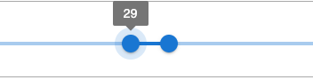
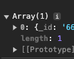
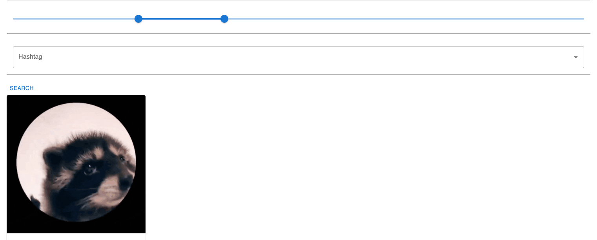

</br>

현재 진행하고 있는 프로젝트에서 나이를 통해 DB에 저장되어있는 회원들을 검색할 수 있는 기능을 구현했다. 
</br>

</br>

### 1. 사용자 생일 저장하기
먼저 DB에 사용자의 생일은 저장해보자.

MongoDB는 ISODate 형식을 저장하고 검색할 때 효율적인 쿼리 수행과 인덱싱을 지원한다. 

form으로 날짜를 입력받고 ISO 8601형식으로 변환해서 저장해보자.

```js
data.birth = new Date(data.birth).toISOString();  
const response = await editProfile(data!);
```

요러케 잘 저장이 되었다.


</br>
</br>

### 2. 클라이언트에서 나이 조건으로 검색하기

이제 클라이언트에서 원하는 조건을 검색해보자. 
MUI의 slider를 사용해서 원하는 나이의 범위를 선택하고 쿼리를 만들어서 날려보자. 


--클라이언트--
```js
const [age, setAge] = useState<number[]>([0, 100]);

<Slider  
    value={age}  
    onChange={handleAgeChange}  
    valueLabelDisplay="auto"  
    getAriaValueText={valuetext}  
    disabled={false}  
/>
```
여기에는 없지만, 다른 조건들도 함께 query string에 포함시켜야 하기 때문에 queryString변수에 나이 조건에 대한 query string 조건을 작성한다.

```js
export async function searchUser(filters:FilterProps){  
     const queryString = new URLSearchParams({  
        ...(filters.age && filters.age.length === 2 ? { age: filters.age.join('-') } : {}),  
    }).toString();  

    try{  
        const response = await instance.get(`/user/searchUsers?${queryString}`);  
        return response.data;  
    }catch(error){  
        throw error;  
    }  
}
```

### 3. 서버에서 나이 범위로 사용자 검색하기


서버에서는 클라이언트에서 나이의 범위를 각각 minAge, maxAge를 분해 구조 할당을 통해 받고 

각 나이의 출생일을 계산한다.

</br>

--서버--
```js
if (age) {
	const [minAge, maxAge] = age.split('-').map(Number);
	const today = new Date();
	
	const maxBirth = new Date(today);
	maxBirth.setFullYear(today.getFullYear() - minAge);
	
	const minBirth = new Date(today);
	minBirth.setFullYear(today.getFullYear() - maxAge);
	
	if (today < new Date(maxBirth.setFullYear(maxBirth.getFullYear() + 1))){
	maxBirth.setFullYear(maxBirth.getFullYear() - 1);
	}
	
	if (today < new Date(minBirth.setFullYear(minBirth.getFullYear() + 1))){
	minBirth.setFullYear(minBirth.getFullYear() - 1);
	}
	
	query.birth = {
		'$gte': minBirth.toISOString(),
		'$lt': maxBirth.toISOString()
	};

}
```

이제 조회를 해보면 95년생 라쿤이 잘 나온다...!

<!--  -->


<br/>